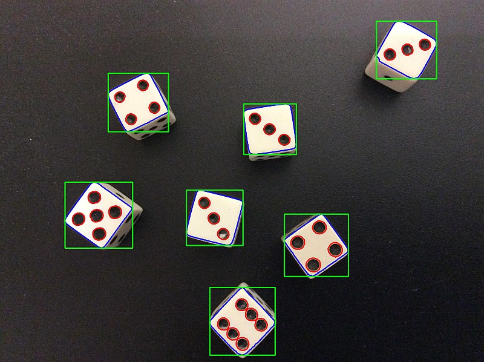
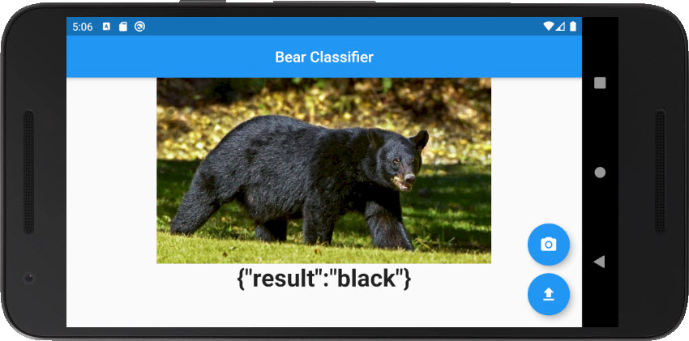
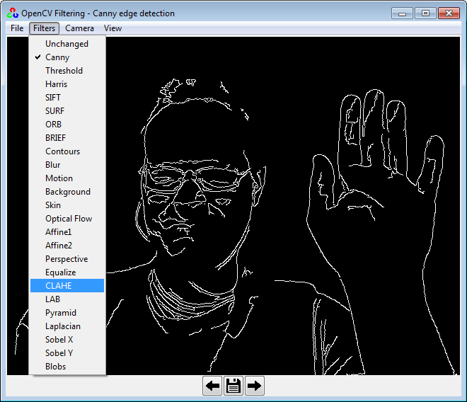
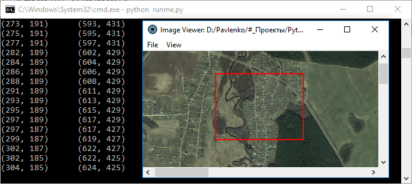
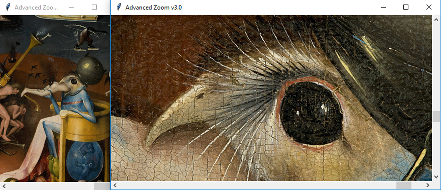
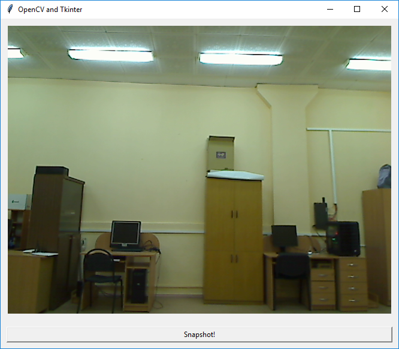
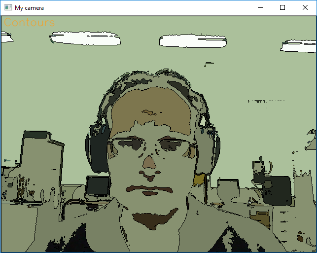
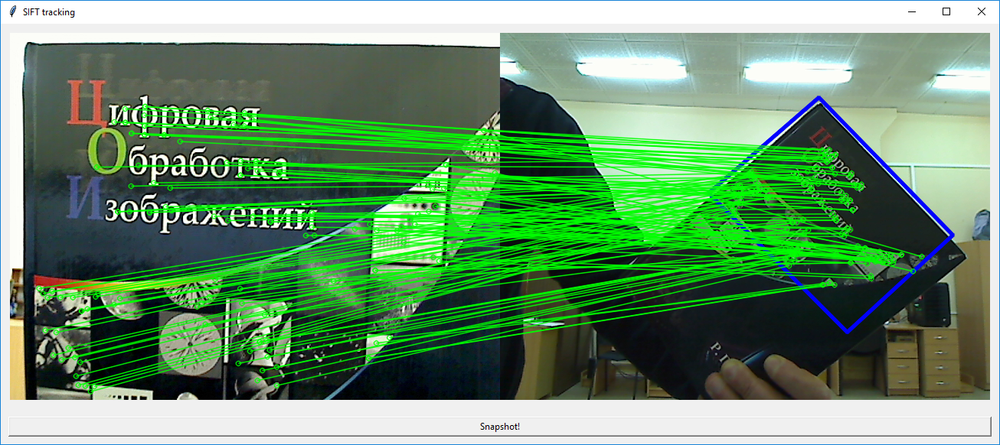
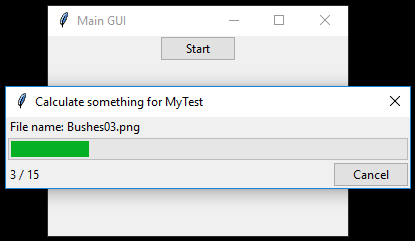

## Chaotic collection of test files, probes, hacks and ideas

<!--

**Under construction...**
-->

   01. [Python notes and links to interesting places](#python_notes)
   01. [General object classifier](#object_classifier)
   01. [OpenCV Filtering GUI](#opencv_filtering)
   01. [Sending emails with Python](#send_email)
   01. [Manual image annotation with polygons](#manual_annotation1)
   01. [Manual image annotation with rectangles](#manual_annotation2)
   01. [Image viewer](#image_viewer)
   01. [Advanced zoom](#zoom)
   01. [**C** extension for Python](#c_extension)
   01. [OpenCV + Tkinter snapshot GUI](#opencv_tkinter)
   01. [OpenCV features](#opencv_features)
   01. [Multilanguage for Python](#multilanguage)
   01. [Dynamic menu](#dynamic_menu)</li>
   01. [Rolling window for 2D array](#rolling_window_2d)
   01. [SIFT object tracking](#sift)
   01. [Tkinter progressbar](#progressbar)

<!--

-->
---
### <a name="python_notes" />[Python notes and links to interesting places](notes_and_links.md)
Bookmarks to remember and re-visit.

---
### <a name="image_processing" />Image Processing with Python
[My replica](https://colab.research.google.com/drive/1M6j5FyqwQtAe85RtbOXkqjQldY8eoT7a)
of this original course: [Image Processing with Python](https://datacarpentry.org/image-processing/).

---
### <a name="object_classifier" />[General object classifier](object_classifier)
Classifies 3 types of bears: bronw, black and teddy bear.

Object classifier is based on:
   * [Python](https://www.python.org) and [fast.ai](https://www.fast.ai)
     for model training through deep learning;
   * [Render](https://render.com) cloud provider to deploy your code in web.
   * [Flutter](https://flutter.dev) mobile development framework with a single code base
     for Android and iOS applications;
   * [Firebase](https://firebase.google.com) for Google Analytics.

And consists of 3 components:
  01. [model training script](object_classifier/01_training_script) - 
      Jupyter (Colab) script to train a classification model.
  02. [web app](https://github.com/foobar167/web_api_for_render) -
      starter project to deploy a trained classification model to the web.
  03. [mobile app](object_classifier/03_mobile_app) -
      mobile application which connect your web app with mobile phone (tested for Android).

---
### <a name="opencv_filtering" />[OpenCV Filtering GUI](opencv_filtering)
OpenCV Filtering GUI is a set of various realtime filters
to process images from the webcam.
This GUI is based on the previous [OpenCV features](#opencv_features) demo with
enhanced Tkinter controls for user-friendly OpenCV real-time filters demonstration.

---
### <a name="send_email" />[Sending emails with Python](send_email)
Sending emails with Python.

---
### <a name="manual_annotation1" />[Manual image annotation with polygons](manual_image_annotation1)
Manual image annotation opens image where user can select polygon areas
around the objects of interest. After selecting region of interest user
presses menu button and program cuts rectangular images from selected
polygons with a scanning window.

---
### <a name="manual_annotation2" />[Manual image annotation with rectangles](manual_image_annotation2)
Manual image annotation creates rectangular images with selected
areas of interest (ROI). User opens image and selects rectangular
areas of interest. After selecting rectangles and pressing menu button
program cuts rectangle images from the bigger image.

---
### <a name="image_viewer" />[Image viewer](image_viewer)
Image viewer shows image and prints coordinates of the rectangular area in the console.

---
### <a name="zoom" />[Advanced zoom](zoom_advanced3.py)
Advanced zoom for images of various formats and sizes
from small to huge up to several GB.

---
### <a name="c_extension" />[**C** extension for Python](co-occurrence_matrix/C_extension_for_Python)
_**C**_ language extension for Python language by example of
co-occurrence matrix calculation.

---
### <a name="opencv_tkinter" />[OpenCV + Tkinter snapshot GUI](opencv_tkinter.py)
Take shapshot using webcamera, OpenCV and Tkinter.
Example is well documented and has many comments inside.

---
### <a name="opencv_features" />[OpenCV features](camera_features.py)
Demo of various OpenCV features.
Application is tested for Windows OS and requires webcam.
There is a [newer version with GUI](opencv_filtering).

---
### <a name="multilanguage" />[Multilanguage for Python](translation)
How-to implement multilanguage for Python.

---
### <a name="dynamic_menu" />[Dynamic menu](dynamic_menu.py)
Example of the dynamic menu for Tkinter GUI.

---
### <a name="rolling_window_2d" />[Rolling window for 2D array](rolling_window_advanced.py)
Example of the rolling window for 2D array. It has zero Python cycles inside,
so the speed is the same as in **C** programming language.

---
### <a name="sift" />[SIFT object tracking](sift_tracking.py)
Example of the objects tracking using SIFT algorithm.
SIFT algorithm is free of charge for non-commercial projects.
  1. Open GUI: `python sift_tracking.py`.
  2. Place object in front of webcamera, so it take all visible space.
  3. Press "Snapshot!" button. Application will make snapshort of the object to track.
  4. After taking snapshort there will be blue rectangle around tracking object
and green lines connecting specian points of the image.

Rectangular objects, like books, are tracked better than faces.

---
### <a name="progressbar" />[Tkinter progressbar](tkinter_progressbar.py)
Example of the Tkinter progressbar GUI.

