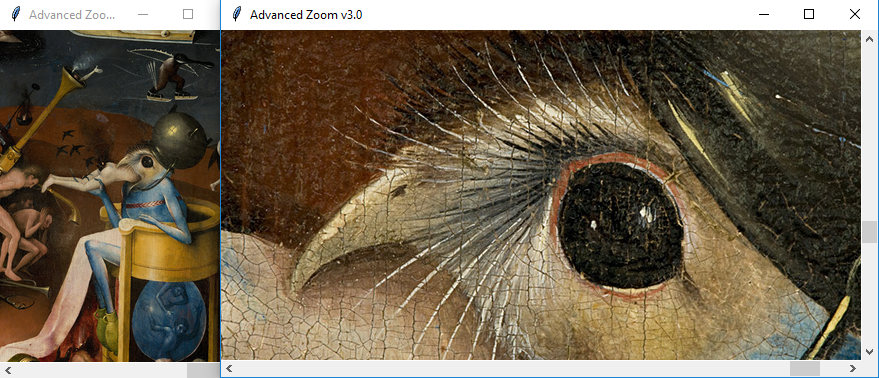
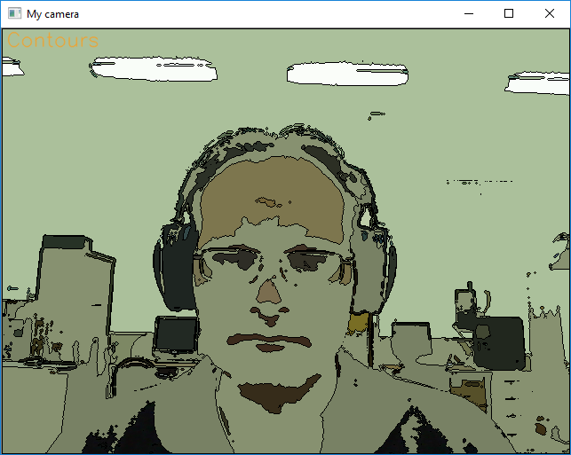
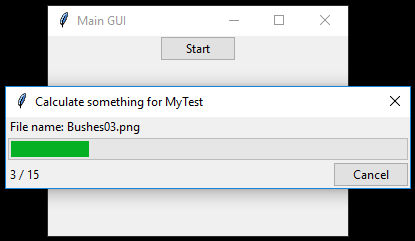

## foobar's junkyard
### Chaotic collection of test files, probes, hacks and ideas.

   12. [Manual image annotation with polygons](manual_image_annotation1)

Manual image annotation opens image where user can select polygon areas
around the objects of interest. After selecting region of interest user
press menu button and program cuts rectangular images from selected
polygons with a scanning window.

   11. [Manual image annotation with rectangles](manual_image_annotation2)

Manual image annotation creates rectangular images with selected
areas of interest. User opens image and select rectangular areas
of interest. After selecting rectangles and pressing menu button
program cuts rectangle images from the bigger image.

   10. [Image viewer](image_viewer)

Image viewer shows image and prints coordinates of the rectangular area in the console.

   09. [Advanced zoom](zoom_advanced3.py)

Advanced zoom for images of various types from small to huge up to several GB

   08. [**C** extension for Python](co-occurrence_matrix/C_extension_for_Python)

**C** language extension for Python language by example of
co-occurrence matrix calculation.

   07. [OpenCV + Tkinter snapshot GUI](opencv_tkinter.py)

Take shapshot using webcamera, OpenCV and Tkinter.

   06. [OpenCV features](camera_features.py)

Different OpenCV features. It works for Windows OS.

   05. [Multilanguage for Python](translation)

Demo of multilanguage implementation for Python.

   04. [Dynamic menu](dynamic_menu.py)

Example of the dynamic menu for Tkinter GUI.

   03. [Rolling window for 2D array](rolling_window_advanced.py)

Example of the rolling window for 2D array. Zero Python cycles.

   02. [SIFT object tracking](sift_tracking.py)

Example of the objects tracking by SIFT algorithm.
SIFT algorithm is free of charge for non-profit projects.

   01. [Tkinter progressbar](tkinter_progressbar.py)

Example of the Tkinter progressbar GUI.

