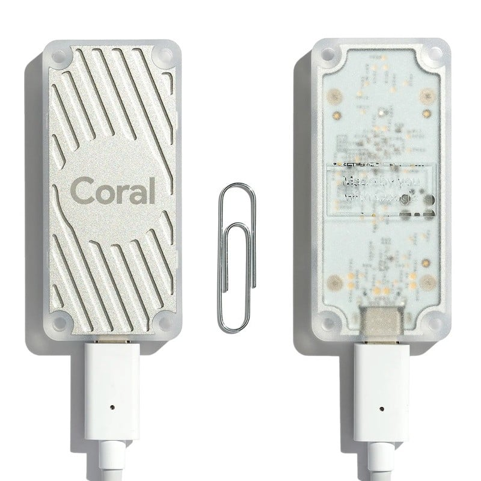
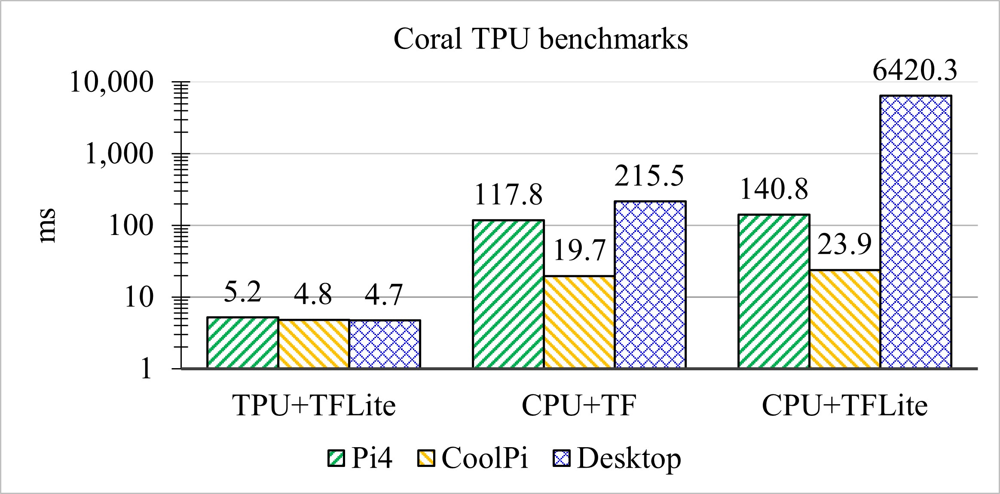

#### Coral TPU

[Google Coral USB Accelerator](https://coral.ai/products/accelerator)
belongs to the Neural Processing Unit (NPU) class
or Tensor Processing Unit (TPU) for Google
and is an application-specific integrated circuit
developed by Google and designed for use with the
TensorFlow Lite machine learning library.

Performance tests for Coral NPU and CPU on various computers
are shown on the diagram below. Less is better

   * Pi4 – **Raspberry Pi 4 Model B** single board computer (SBC) with
Broadcom BCM2711 chipset running the Debian GNU/Linux 11 (bullseye)
operating system (OS).
   * CoolPi – **Cool Pi 4 Model B** SBC with Rockchip RK3588s chipset
running Ubuntu Linux 22.04.3 LTS (Jammy Jellyfish) OS.
   * Desktop – CPU **Intel i7-4770** personal computer with
Intel Lynx Point Z87 (Intel Haswell) chipset running Microsoft Windows 10 OS.

 

* "TPU+TFLite" – performance tests for Coral TPU with 4 TOPS.
* "CPU+TF" – performance tests for CPU and the TensorFlow library (TF).
* "CPU+TFLite" – performance tests for CPU and the TensorFlow Lite (TFLite) library.
* "TPU+TF" – the 4th combination Coral TPU with TensorFlow 
does not work with existing neural network models.

Tests are made for the image classification task using
**MobileNet v3** artificial neural network model trained on ImageNet dataset.
Files `tf2_mobilenet_v3_edgetpu_1.0_224_ptq_edgetpu.tflite` for TPU and
`tf2_mobilenet_v3_edgetpu_1.0_224_ptq.tflite` for CPU are from the Coral
[data repository](https://github.com/google-coral/test_data/tree/104342d2d3480b3e66203073dac24f4e2dbb4c41).
The benchmark software is located in the files
[tf_lite.py](tf_lite.py) and
[tf_lite_benchmarks.py](tf_lite_benchmarks.py).
Log file with [test results](data/2023.09.01-coral-tpu-benchmark-results.txt).
