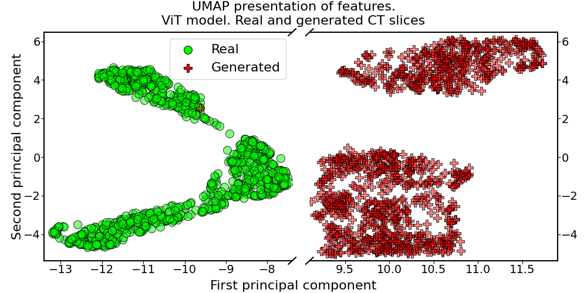

#### Examples of data visualization

Examples of data visualization using [matplotlib](https://matplotlib.org/) library.

   * [Features visualization](Features_visualization.ipynb) using scatter plots.
[Colab](https://colab.research.google.com/drive/18xbshD4dVL8c9E4yoKnOXb5E0dTWjsSj)
