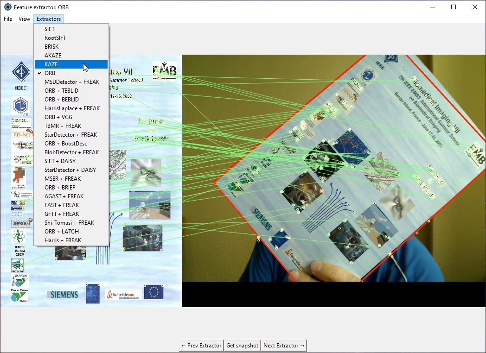

#### Object tracking

Object tracking using OpenCV
*features detectors* (detectors) and *descriptor extractors* (descriptors)
algorithms with GUI for fun, tests and education. 



This application only processes one image.
Good object tracker processes sequence of images in a video.
For example, this
[OpenCV object tracking](https://pyimagesearch.com/2018/07/30/opencv-object-tracking/) algorithms.

**Only OpenCV** integrated detectors, descriptors and
detector-descriptors are used.

**Neural Network** detector-descriptors (such as
R2D2, D2NET, SUPERPOINT, ORB-SLAM2, DELF, CONTEXTDESC, LFNET, KEYNET, DISK,
[etc](https://github.com/luigifreda/pyslam/blob/master/pyslam/local_features/feature_types.py))
and descriptors (such as TFEAT, HARDNET, GEODESC, SOSNET, L2NET, LOGPOLAR,
[etc](https://github.com/luigifreda/pyslam/blob/master/pyslam/local_features/feature_types.py))
are not considered.

All object trackers in the application are placed in *decrease of efficiency* and
implemented *rotation invariant* and *scalable* except of `"StarDetector + DAISY"`.
It doesn't mean that lower methods are always ineffective!
However, for this task it is so,
because there is no "silver bullet" method for all tasks.

All feature detector-descriptor logic is in the
[logic_extractor.py](./extractor/logic_extractor.py) file.
Snapshots, logs and configuration parameters are saved in `temp` directory
of the current `feature_extractor` folder.
Overall the GUI source code is not as elegant as I would like, but it works :-).

Previous simple script is here
[SIFT object tracking](../scripts_simple/sift_tracking.py).
SIFT algorithm became free since March 2020.
SURF algorithm is patented and is excluded from OpenCV.
Now SURF is for Python version 3.4.2.16 and older.

App is tested on **Windows 10** for Python **3.12**.

External libraries:
   * [OpenCV](https://docs.opencv.org/4.x/d6/d00/tutorial_py_root.html) to process images.
   * [NumPy](https://numpy.org/) to support calculations with arrays.
   * [Pillow](https://pillow.readthedocs.io/en/stable/) to open images of [various formats](https://pillow.readthedocs.io/en/stable/handbook/image-file-formats.html).

How to start the app:

```shell
# Install additional libraries
pip install -r requirements.txt
# Run the application
python runme.py
```

Usage:
  1. To open the GUI, run command in you console `python runme.py`.
  2. Place object in front of the web camera, so it take all visible space.
  3. Press `Get snapshot` button. Application will make snapshot of the object to track.
  4. After taking snapshot there will be a red rectangle around tracking object
and green lines connecting special keypoints of the image.

**Note:** Rectangular object, like book, is tracked better than face.

Check out the
[PowerPoint presentation](./data/presentation-opencv-descriptos.pptx)
of the application in the `data` subdirectory.
