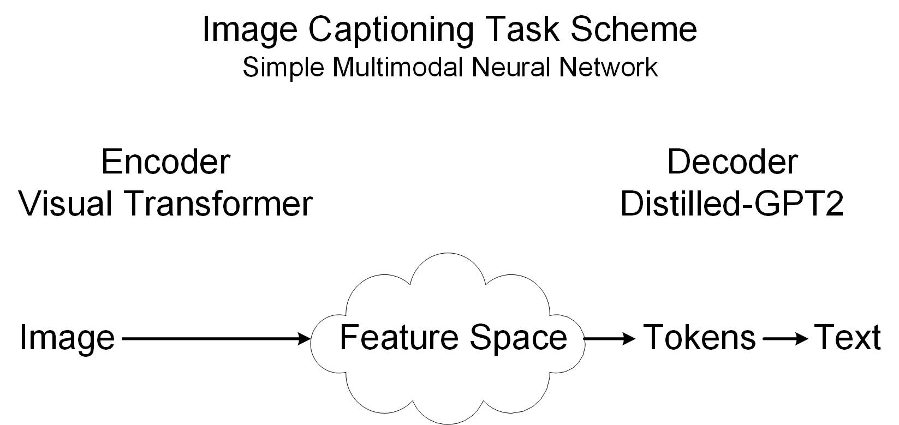

#### Fine-tuning and feature extraction

Image-to-text training pipeline.
Feature extractors, i.e., dots in the feature space,
for ViT, ResNet50 and VAE models.

[//]: # (   * [Image Captioning Using ViT and GPT2 Transformers]&#40;Image_Captioning_with_ViT_and_GPT2_v2.ipynb&#41;)

[//]: # (is an image-to-text training pipeline.)
   * [Image Captioning with Minimal Detailes](Image_Captioning_with_Min_Detailes.ipynb)
using Vision Encoder Decoder (ViT + GPT2) model that fine-tuned on
flickr8k-dataset for image-to-text task.
   * [Vision Transformer (ViT)](ViT_Fine_Tuning.ipynb)
fine-tuning ViT model using [timm](https://timm.fast.ai/) library.
After fine-tuning, the feature extractor is performed.
   * [ResNet50](ResNet50_Fine_Tuning.ipynb) fine-tuning and feature extractor.
   * [Variational Autoencoder (VAE)](VAE_feature_extractor.ipynb) feature extractor.
