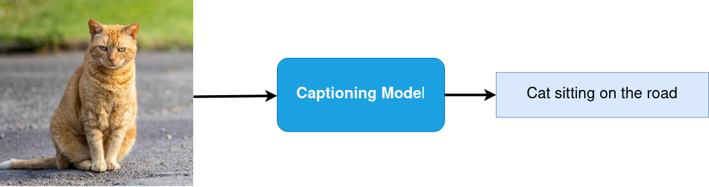

#### Fine-tuning and feature extraction

Image-to-text training pipeline.
Feature extractors, i.e., dots in the feature space,
for ViT, ResNet50 and VAE models.

   * [Qwen 3.5 4B image-text fine-tuning using the LaTeX OCR dataset](2026.03.19_Qwen3.5_4B_image_text_fine_tuning.ipynb)
[Colab](https://colab.research.google.com/drive/1TUR3OqHqm0E9SrhvBOER1ehqWlxfL0pS)
   * [Chest X-Ray Captions Using Transformers and the ReXGradient-160K Dataset](CXR_Captions_v1.ipynb)
   * [Some experiments on how to Build an AI Agent from Scratch in Raw Python](2025.06.23_AI_Agent.ipynb)
   * [Very simple Attention mechanism implementation](Attention_study.ipynb)
   * [Image Captions Using ViT and GPT2 Transformers](Image_Captions_with_ViT_GPT2.ipynb)
is an image-to-text training pipeline.
   * [Example of text augmentations](Text_Augmentations.ipynb)
   * [Image Captions with Minimal Details](Image_Captions_Min_Detailes.ipynb)
using Vision Encoder Decoder (ViT + GPT2) model that fine-tuned on
flickr8k-dataset for image-to-text task.
   * [Vision Transformer (ViT)](ViT_Fine_Tuning.ipynb)
fine-tuning ViT model using [timm](https://timm.fast.ai/) library.
After fine-tuning, the feature extractor is performed.
   * [ResNet50](ResNet50_Fine_Tuning.ipynb) fine-tuning and feature extractor.
   * [Variational Autoencoder (VAE)](VAE_feature_extractor.ipynb) feature extractor.
