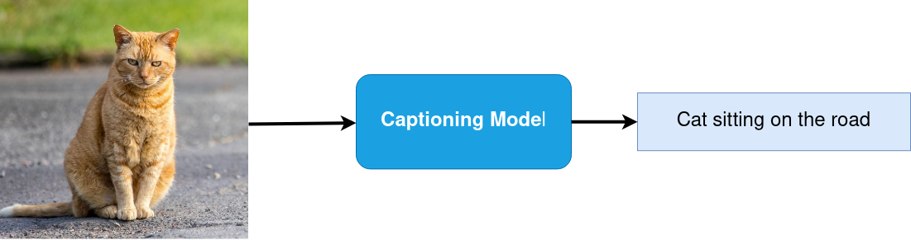

#### Fine-tuning and feature extraction

Image-to-text training pipeline.
Feature extractors, i.e., dots in the feature space,
for ViT, ResNet50 and VAE models.

   * [Source code for the text evaluation metrics](./text_evaluation_metrics)
or via [Colab](https://drive.google.com/drive/folders/1jcWfnT9MmrB2j2Vt_gvnqluV0AR8aaNy)
   * [Chest X-Ray Captions Using ResNet18-LSTM Model and Screening Dataset](2026.06.02_Xrays_image_captioning.ipynb)
or via [Colab](https://colab.research.google.com/drive/1xJOqyYUQYJS6F5lqNl8Drvpdz6U55OYM)
   * [Chest X-Ray Captions Using Qwen and Screening Dataset](2026.05.31_CXR_Captions_v3_Qwen_for_Screening.ipynb)
or via [Colab](https://colab.research.google.com/drive/1ZeZUw_Y05rtzDrE7WEYvlhoFUac0J6H-)
   * [Chest X-Ray Captions Using Transformers and Screening Dataset](2026.05.29_CXR_Captions_v4_Transformer_for_Screening.ipynb)
or via [Colab](https://colab.research.google.com/drive/19sro6kvoAv7KsM0jtMHkFgUD8daDNGT5)
   * [Chest X-Ray Captions Using Qwen and ReXGradient-160K Dataset](CXR_Captions_v2.ipynb)
or via [Colab](https://colab.research.google.com/drive/1XNLpU1jjJxCWigOqQaKKEu7ZZR1kxRKb)
   * [Chest X-Ray Captions Using Transformers and the ReXGradient-160K Dataset](CXR_Captions_v1.ipynb)
or via [Colab](https://colab.research.google.com/drive/1-OPP9PZ4xRaukW-HSzt-nM_ln6ECMTMv)
   * [Qwen2-VL-7B image-text fine-tuning using the LaTeX OCR dataset](2026.02.27_Qwen2_VL_7B_image_text_fine_tuning.ipynb)
or via [Colab](https://colab.research.google.com/drive/1fyAYaqiDUlWfEMvvbgsDt2Ro3QpsGWbx)
   * [Some experiments on how to Build an AI Agent from Scratch in Raw Python](2025.06.23_AI_Agent.ipynb)
   * [Very simple Attention mechanism implementation](Attention_study.ipynb)
   * [Image Captions Using ViT and GPT2 Transformers](Image_Captions_with_ViT_GPT2.ipynb)
is an image-to-text training pipeline.
Also, here is a [draft](Image_Captions_with_ViT_and_GPT2_draft.ipynb) that doesn't work.
   * [Examples of text augmentations](Text_Augmentations.ipynb)
   * [Image Captions with Minimal Details](Image_Captions_Min_Detailes.ipynb)
using Vision Encoder Decoder (ViT + GPT2) model that fine-tuned on
flickr8k-dataset for image-to-text task.
   * [Vision Transformer fine-tuning for classification on medical images](ViT_Fine_Tuning.ipynb).
Fine-tuning ViT model using [timm](https://timm.fast.ai/) library.
After fine-tuning, the feature extractor is performed.
Or via [Colab](https://colab.research.google.com/drive/1YlzOF8SWG9e5sCYpXZcvjVNKa2EQ8hk7)
   * [ResNet50](ResNet50_Fine_Tuning.ipynb) fine-tuning and feature extractor.
   * [Variational Autoencoder (VAE)](VAE_feature_extractor.ipynb) feature extractor.
