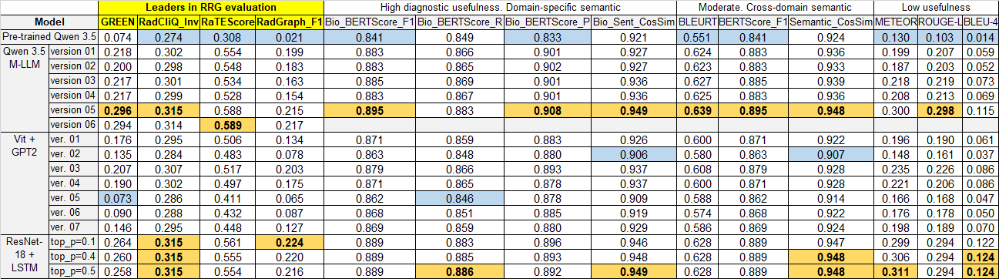

# Text Evaluation Metrics

The metrics are ranked below in decreasing order of clinical importance
and reliability for radiological reports:

* Leaders in Radiology Report Generation (RRG) evaluation:
   * GREEN (Generative Radiology Report Evaluation and Error Notation) is the most advanced metric in the field of RRG to date, developed by Stanford researchers (Stanford AIMI) in late 2024. It operates on the LLM-as-a-judge principle;
   * RadCliQ_Inv (Radiology Report Clinical Quality Inverted) is an automated inverted composite evaluation metric designed to measure the clinical accuracy and quality of AI-generated radiology reports. By aligning closely with radiologists’ expert judgments, it overcomes the limitations of traditional, surface-level language metrics;
   * RaTEScore (Radiological Report Text Evaluation) was explicitly designed to fix RadGraph's flaws;
   * RadGraph_F1 (Radiology Graph) is a specialized NLP metric that evaluates RRG by converting text into a clinical knowledge graph and measuring the harmonic mean of accurately matched medical entities and their anatomical relationships;

* High diagnostic usefulness. Domain-specific semantic:
   * Bio_BERTScore_F1 (Bio-Clinical Balanced Score);
   * Bio_BERTScore_R (Bio-Clinical Recall);
   * Bio_BERTScore_P (Bio-Clinical Precision);
   * Bio_Sentence_CosSim (Biomedical Sentence Embedding Similarity);

* Moderate diagnostic usefulness. Cross-domain semantic:
   * BLEURT (Learned Token-to-Sentence Metric);
   * BERTScore_F1 (General-Domain Contextual Similarity);
   * Semantic_CosSim (General-Domain Sentence Similarity);

* Low diagnostic usefulness:
   * METEOR (Advanced Lexical Overlap);
   * ROUGE-L (Longest Common Subsequence Lexical Overlap);
   * BLEU-4 (4-Gram Lexical Precision).
