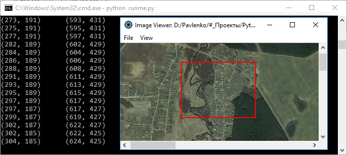

##### Image Viewer (demo)

Image Viewer opens image and selects rectangle area
around the mouse. When user moves the mouse rectangle area
goes after it.

There is an output in the console: upper left and bottom right
corners of the rectangle.

To start Image Viewer:
c:\path\to\your\python_3.x\version\python.exe runme.py

Tested on Windows for Python 3.6.
