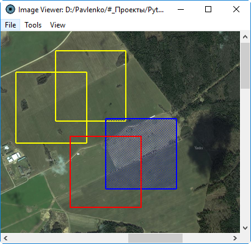
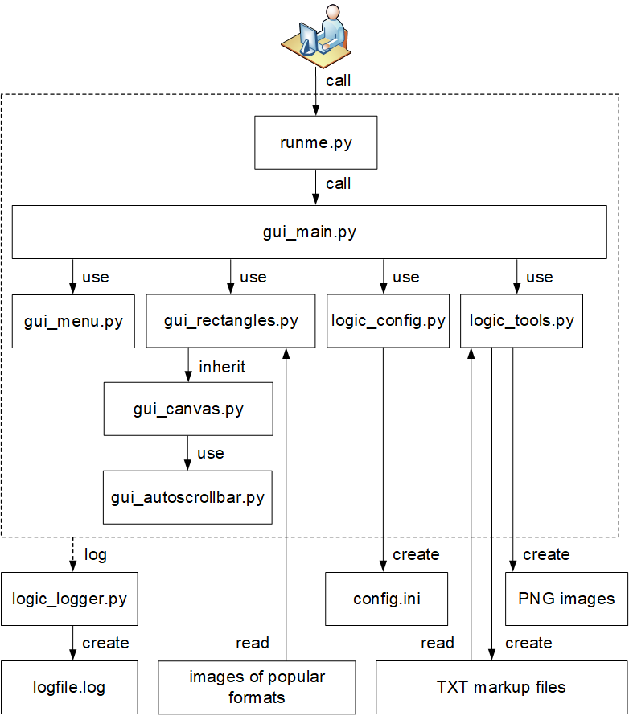

#### Manual image annotation with rectangles



Manual image annotation creates rectangular images with selected
areas of interest (ROI). User opens image and selects rectangular
areas of interest.

After selecting rectangles and pressing menu button program cuts
rectangle images from the bigger image.

All parameters are saved in configuration INI file `config.ini`,
which is in the `temp` directory.

The output of the application is the set of rectangular images
in the `temp` directory.

Also it saves rectangular areas for the image in TXT format.
You could open saved areas, modify them and cut image again.

Tested on **Windows** and **Ubuntu** for Python **3.7**.

External libraries:
   * **Pillow** to open images of [various formats](https://pillow.readthedocs.io/en/stable/handbook/image-file-formats.html).

To start Manual Image Annotation with rectangles:
```shell
# Install additional packages
pip install pillow
# Run it
python runme.py
```

Software architecture:


