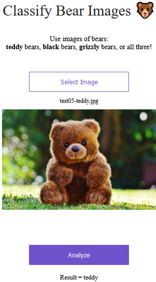
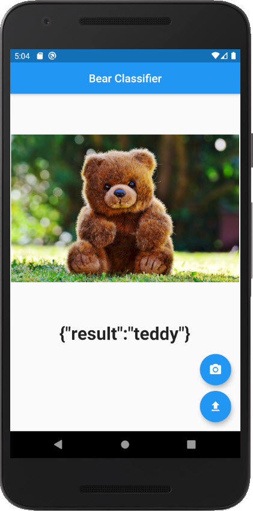
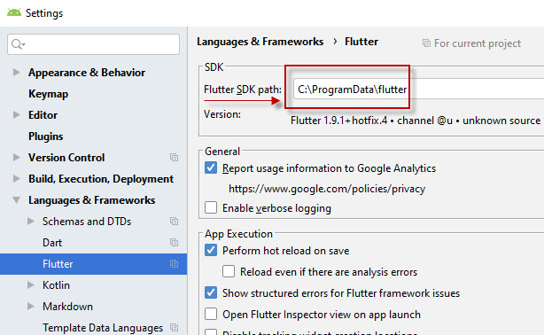
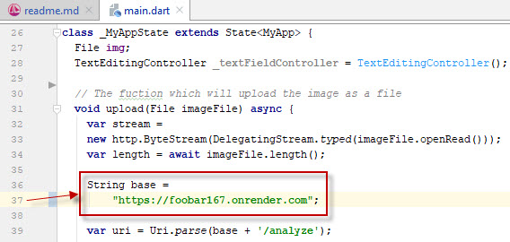

## General object classifier

   - [Introduction](#introduction)
   - [Step 1. Create dataset](#step-1)
   - [Step 2. Transfer learning](#step-2)
   - [Step 3. Deploy web app](#step-3)
   - [Step 4. Deploy mobile app](#step-4)
   - [Step 5. Make your app commercial](#step-5)

---
### <a name="introduction" />Introduction
Classifies 3 types of bears: bronw, black and teddy bear.


Watch [original video](https://youtu.be/CzPYgRaYWUA) of [Siraj Raval](https://sirajraval.com/) first.
And review the [original code](https://github.com/llSourcell/image_classifier_template)
of an image classification startup.

This is a **back-end** solution for **image classification** on Android.
For the **front-end** solution, please, visit my project for
[object detection](https://github.com/foobar167/android/tree/master/object_detection_demo) on Android.

General object classifier is based on:
   * [Python](https://www.python.org) and [fast.ai](https://www.fast.ai)
     for model training through deep learning;
   * [Flutter](https://flutter.dev) mobile development framework with a single code base
     for Android and iOS applications;
   * [Firebase](https://firebase.google.com) for Google Analytics and user authentication;
   * [Stripe](https://stripe.com) as the payment processor.

and consists of five steps:
   1. Find an image dataset via [Google Dataset Search](https://toolbox.google.com/datasetsearch)
      or [Awesome Public Datasets](https://github.com/awesomedata/awesome-public-datasets) list.
      Also you can download images via [google_images_download](https://pypi.org/project/google_images_download)
      Python script or [Fatkun Batch Download Image add-on](https://chrome.google.com/webstore/detail/fatkun-batch-download-ima/nnjjahlikiabnchcpehcpkdeckfgnohf)
      for Chrome browser.
   2. Transfer learning. Take some trained model and retrain a part of it on your relatively small
      image dataset. To perform transfer learning install [fast.ai](https://www.fast.ai)
      vision library (version [1.0.57](https://pypi.org/project/fastai) or later).
      Fast.ai is built on top of [PyTorch](https://pytorch.org).
      During transfer training most weights of neural network are frozen in place
      except for the last layer.
   3. Deploy the web app. Fast.ai made [this](https://github.com/render-examples/fastai-v3)
      impressively simple starter application for deploying fast.ai models on Render,
      for instantly creating a web app and mobile app for your classifier.
   4. Build the mobile app. Connect your Flutter app to the web app from the previous step.
   5. Sign up for [Firebase](https://firebase.google.com) and [Stripe](https://stripe.com).
      **This step is not finished**.

There are 3 main components:
   01. [model training script](01_training_script) - 
       Jupyter (Colab) script to train a classification model.
   02. [web app](https://github.com/foobar167/web_api_for_render) -
       starter project to deploy a trained classification model to the web.
   03. [mobile app](03_mobile_app) -
       mobile application which connect your web app with mobile phone (tested for Android).

Additionaly some more TensorFlow examples and links [here](https://github.com/foobar167/articles/tree/master/Machine_Learning)
and [here](https://github.com/foobar167/articles/blob/master/Ubuntu/13_Keras_and_TensorFlow_how-tos.md).

---
### <a name="step-1" /> Step 1. Create dataset
Create your own directories with images, download data using
[google_images_download](https://pypi.org/project/google_images_download) or
[Fatkun Batch Download Image add-on](https://chrome.google.com/webstore/detail/fatkun-batch-download-ima/nnjjahlikiabnchcpehcpkdeckfgnohf).
Find some datasets to train via
[Google Dataset Search](https://toolbox.google.com/datasetsearch) and
[Awesome Public Datasets](https://github.com/awesomedata/awesome-public-datasets).
Or continue with existing
[bears classification](01_training_script).

Install [fastai](https://pypi.org/project/fastai/) if you need to train on your local computer:
```shell script
# Install PyTorch and Torchvision first, because fast.ai is built on top of PyTorch.
# Installation video - https://deeplizard.com/learn/video/UWlFM0R_x6I
# Be patient, it is 750.2 MB for now :-)
# For example: Stable 1.2 -> Windows -> Conda or pip -> Python 3.7 -> CUDA 10.0
pip3 install torch===1.2.0 torchvision===0.4.0 -f https://download.pytorch.org/whl/torch_stable.html
conda install pytorch torchvision cudatoolkit=10.0 -c pytorch
# Check it
pip list | grep torch
conda list torch

# PyPI Install
pip install fastai
# Conda Install
conda install fastai pytorch -c fastai -c pytorch -c conda-forge
conda install -c fastai fastai

# Check it
python -m fastai.utils.show_install
# Activate Anaconda environment and check it
conda activate
python -m fastai.utils.show_install
conda deactivate
```

---
### <a name="step-2" /> Step 2. Transfer learning
This is the original [`bear_classifier.ipynb`](https://github.com/naveenchanakya/bear-classifier/blob/master/bear_classifier.ipynb)
file of the [Bear Classifier](https://github.com/naveenchanakya/bear-classifier) project.

Run in [Jupyter Notebook](https://jupyter.org) file called
[`bear_classifier.ipynb`](01_training_script/bear_classifier.ipynb)
if you have computer **with modern GPU** or upload and run it in
[Google Colab](https://colab.research.google.com/drive/1pFSa6Bf2ddJe_ZdJBr9uQOANLRbsRwaf)
if you do not have modern GPU.

Replace the bear dataset with your own image dataset.
Retrain a `resnet34` image classification model.
Such retraining is called transfer learning.

Save the resulting model `pkl` file to Google Drive and save the download link.

---
### <a name="step-3" /> Step 3. Deploy web app


This is the original project
[Starter for deploying fast.ai models on Render](https://github.com/render-examples/fastai-v3).

[Render](https://render.com/docs) is a modern **cloud provider** that makes it effortless
and instant to deploy your code in production. You can deploy anything on Render,
from simple static sites and cron jobs to databases and Docker-ized private services.

Render deploys your services directly from GitHub or GitLab.
All that's needed is to push your code like you normally do.
Render automatically updates your services and keeps them up and running at all times.

   * Fork the [web app](https://github.com/foobar167/web_api_for_render) repository.
   * Follow the instructions in its [readme.md](https://github.com/foobar167/web_api_for_render)
     to deploy it to [Render](https://render.com).
   * Once deployed, check that it works.
   * Then replace line 12 in [`server.py`](https://github.com/foobar167/web_api_for_render/blob/master/app/server.py)
     of the web example with a link to your own classifier `pkl` file.
     Update the `model_file_url` variable with the URL copied above.
     Update `export_file_name` to `bears_trained_model.pkl`.
     Update `classes` if you have other classes. Re-deploy.
   * Make any cosmetic changes to the front-end interface that you'd like.
   * Review (after 6 min) and test the [web-site](https://foobar167.onrender.com)!

---
### <a name="step-4" /> Step 4. Deploy mobile app


   * [Install](https://flutter.dev/docs/get-started/install) Flutter.
     Run `flutter doctor` in console. Resolve problems with certificates and
     [plugins](https://stackoverflow.com/a/52816669/7550928).<br /><br />
     <br /><br />
   * Download and open [this code](03_mobile_app/) in Android Studio as a new Flutter project.<br /><br />
   * It will ask you to 'get' all dependencies, say yes and it'll will all be installed automatically.<br />
     If you get error `Because flutter_app11 depends on flutter_test any from sdk which doesn't exist
     (the Flutter SDK is not available), version solving failed`. Then you need to configure path to
     Flutter in project settings: `File --> Settings --> Languages & Frameworks --> Flutter -->
     Flutter SDK path`. Enter your path to Flutter directory.<br /><br />
     <br /><br />
   * Run `flutter packages get` in console in [project directory](03_mobile_app).
     It'll update [`.packages`](03_mobile_app/.packages) file.<br /><br />
   * Replace the default render link in [`main.dart`](03_mobile_app/lib/main.dart)
     to the link to your deployed render app.<br /><br />
     <br /><br />
     [Dart](https://dart.dev) is a client-optimized programming language for fast apps
     on multiple platforms. It is developed by Google and is used to build mobile,
     desktop, backend and web applications.<br /><br />
   * Notice the 2 functions `user_signup` and `user_login`
     in the [`main.dart`](03_mobile_app/lib/main.dart) file.
     This is where your stripe and firebase authentication code will be placed
     to make your app commercial.<br /><br />

---
### <a name="step-5" /> Step 5. Make your app commercial
Signup for [Firebase](https://firebase.google.com) and
[Stripe](https://stripe.com). Confirm your e-mail during signup.

[Connect](https://firebase.google.com/docs/flutter/setup) the user login flow to Firebase:
   * create a Firebase project to connect to your app;
   * add Firebase to your Android app with the package name `com.example.flutter_app11`;
   * download `google-services.json` file in to [android/app](03_mobile_app/android/app) folder;
   * modify [android/build.gradle](03_mobile_app/android/build.gradle) and
     [android/app/build.gradle](03_mobile_app/android/app/build.gradle)
     files if necessary according to instructions;
   * change `gradle-5.6.2-all.zip` to actual version in `distributionUrl` of
     [gradle-wrapper.properties](03_mobile_app/android/gradle/wrapper/gradle-wrapper.properties)
     file.

[Configure](https://pub.dev/packages/stripe_payment) a Flutter to integrate the Stripe plugin
for iOS and Android if you like, but I did not. 

[Prepare](https://flutter.dev/docs/deployment/android) your Android application
for release to the Google Play Store if you like, but I did not.

I excluded (commented out) user authentication code
in the [main.dart](03_mobile_app/lib/main.dart).
