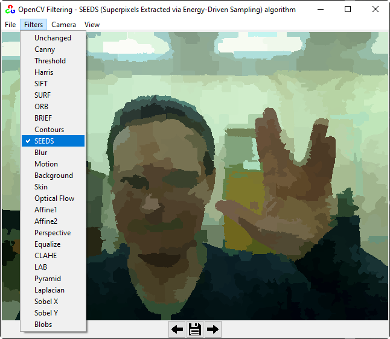
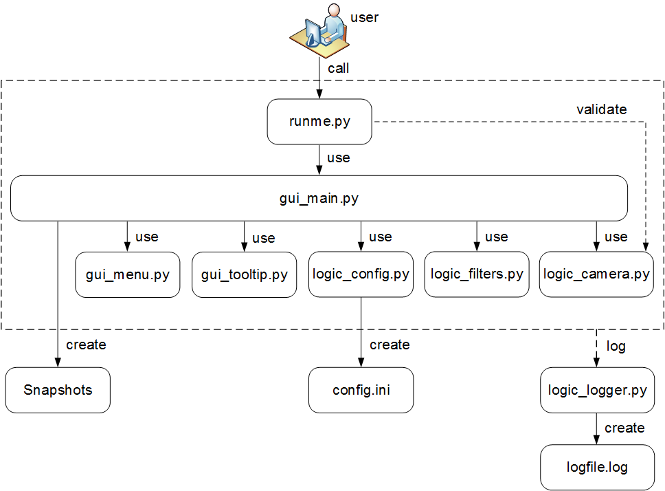

#### OpenCV Filtering GUI application



OpenCV Filtering GUI is a set of various realtime filters
to process images from the webcam.

Tested on Windows **10/7** and Ubuntu **18.04** for Python **3.7.4** amd OpenCV **3.4.2.16**.

External libraries:
   * **OpenCV with contributions, version 3.4.2.16**, [`opencv-contrib-python==3.4.2.16`](https://pypi.org/project/opencv-contrib-python) package.
     Why OpenCV version **3.4.2.16** and not newer? Because it seems that SIRF and SURF are
     [no longer available in opencv > 3.4.2.16](https://github.com/DynaSlum/satsense/issues/13).
     If you need SIRF and SURF algorithms use OpenCV 3.4.2.16 or older.
   * **Pillow** to open images of [various formats](https://pillow.readthedocs.io/en/stable/handbook/image-file-formats.html).
   * **NumPy** support for [arrays and matrices](https://numpy.org/).

To start OpenCV Filtering GUI:
```shell script
# Install additional packages
pip install opencv-contrib-python==3.4.2.16 pillow numpy
# Run it
python runme.py
```

Software architecture:

