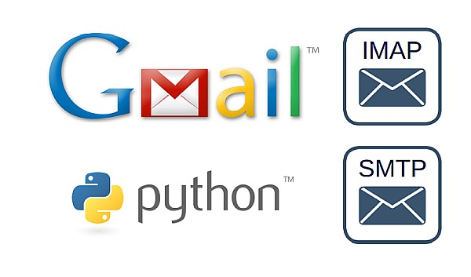

### Sending emails with Python

#### Links
   * [Sending Emails With Python](https://realpython.com/python-send-email)
   * [Gmail Python Quickstart](https://developers.google.com/gmail/api/quickstart/python)

#### Warning!
[Spamming is a crime](https://en.wikipedia.org/wiki/Email_spam_legislation_by_country) in many countries.

#### Description
Use `Yagmail` and `Keyring` packages to send email securely in file
[send_email_using_yagmail.py](send_email_using_yagmail.py).

Send email using `SMTP_SSL()` in file
[send_email_using_smtp_ssl.py](send_email_using_smtp_ssl.py).

Send email using `.starttls()` in file
[send_email_using_starttls.py](send_email_using_starttls.py).

[quickstart.py](quickstart/quickstart.py) is a simple Python command-line
application that makes requests to the Gmail API
